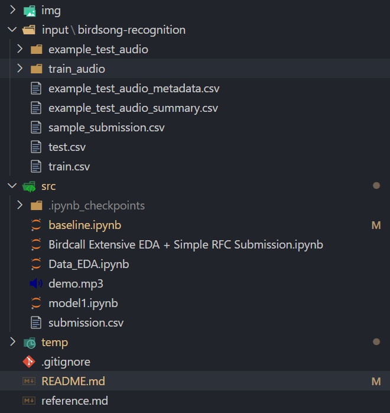
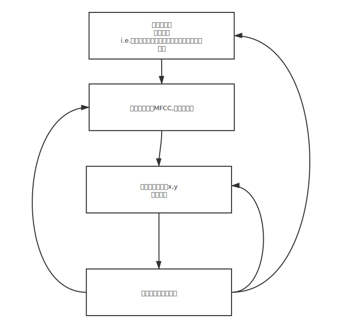

## BirdRecognition
This is the repository for the Kaggle project - [Cornell Birdcall Identification](https://www.kaggle.com/c/birdsong-recognition)


**Usage:** 
- place your */birdsong-recognition* (downloaded & unzipped from Kaggle) since it will be gitignored by default.
  
- It should look like this:
  <!--  -->
```
.
├── README.md
├── img # 图片
│   ├── flowchart.svg
│   └── structure
├── input # 输入
│   └── birdsong-recognition #数据文件夹
├── reference.md
├── src # 源文件
│   ├── Birdcall Extensive EDA + Simple RFC Submission.ipynb
│   ├── Data_EDA.ipynb
│   ├── baseline.ipynb
│   ├── demo.mp3
│   ├── model1.ipynb
│   ├── submission.csv
│   └── submission1.csv
└── temp # 缓存
    └── temp.wav
```
#### Flowchart



#### Methods

- **Method 1: Machine Learning (sklearn-based)**
  - Source File:  *baseline.ipynb*
    - This method uses the traditional statistical ways to analyse the relations and do predictions.
  - It could take +1 hr for the baseline model to be processed.
  