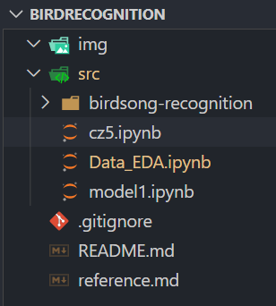

## BirdRecognition
This is the repository for the Kaggle project - [Cornell Birdcall Identification](https://www.kaggle.com/c/birdsong-recognition)

**Usage:** 
- place your */birdsong-recognition* (downloaded & unzipped from Kaggle) since it will be gitignored by default.
  
- It should look like this: